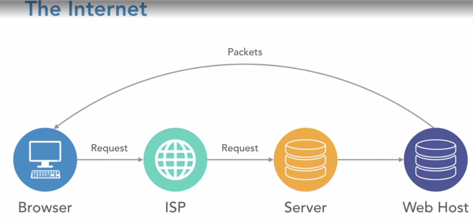
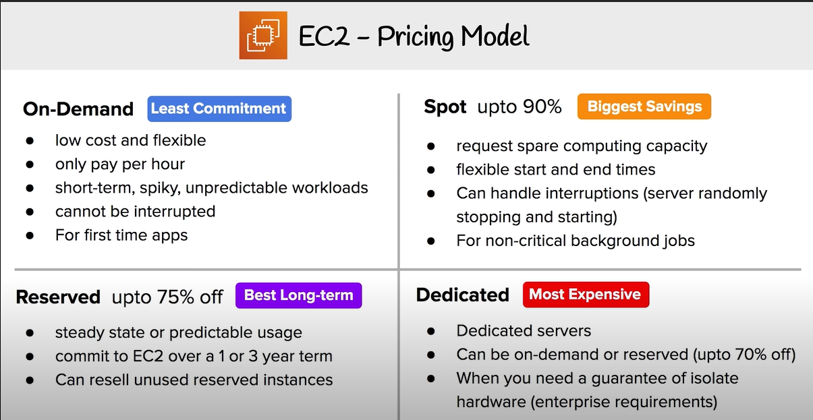
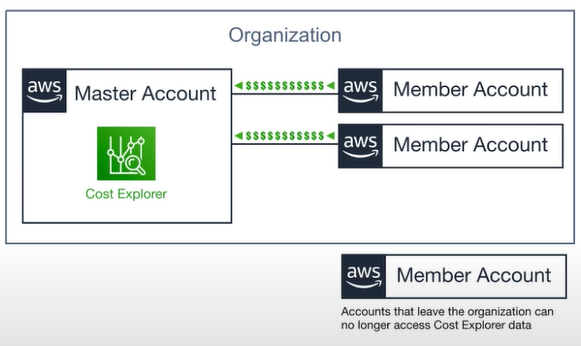

# Introduction
Domain 1: Cloud Concepts 
	- 28%    
	- Define the AWS cloud   
	- Identify aspects of the AWS Cloud economics  
	- Describe different cloud architecture design principles 
	
Domain 2: Security and Compliance
	- 24%    
	- Define AWS shared responsibility model      
	- Define AWS Cloud Security and compliance concepts   
	- Identify AWS access management capabilities      
	- Identify resources for security support    
	
Domain 3: Technology 
	- 36%  
	- Define method of deploying and operating IT applications in the AWS cloud   
	- Define AWS global infrastructure   
	- Identify the core AWS services   
	- Identify ways to contact support 
	
Domain 4: Billing and Pricing 
	- 12% but tricky   
	- Remember different pricing models for AWS  
	- Recognise various account structures in AWS billing and pricing   
	- Identify resources available for billing support   

### Exam Prep
	- AWS Training - aws.amazon.com/training
	- AWS Whitepaper - aws.amazon.com/whitepapers

#Cloud Concepts

     
### What is Cloud Computing?
The practice of using a network of remote servers hosted on the Internet to store, manage, and process data, rather than a  local server or a personal computer   

On-Premise | Cloud Providers
---|---
You own the servers |Someone else owns the servers
You hire the IT people| Someone else hires the IT people 
You pay or rent the real estate| Someone else pays or rents the real-estate
You take all the risk  |You are responsible for your configuring cloud services and code, someone else takes care of the rest

### Why Use Cloud Provider Over On-Prem
1. _Trade capital expense for variable expense - No upfront-cost__ instead of paying for data centres and servers __Pay On-Demand__ Pay only when you consume computing resources
2. __Benefit from massive from massive economies of scale__ - Using from hundreds of thousands of customers aggregated in the cloud . You are __Sharing the cost with other customers__ to get unbeatable savings 
3. __Stop guessing Capacity__ - Eliminate guesswork about infrastructure capacity needs. __Instead of paying for idle or underutilised servers, you can scale up or down to meet the current need.
4. __Increase speed and agility__ - Launch resources __within a few clicks in a minute__ instead of waiting days or weeks of your IT to implement the solution on-prem
5. __Stop sending money on running and maintaining data centres - Focus on your own customers__ , rather than on the heavy lifting of racking, stacking and powering servers 
6. __Go global in minutes__ - Deploy your app in __multiple regions around the world with a few clicks. Provide low latency and a better experience for your customers at minimal
	
### Types of Cloud Computing 


__SAAS for Customers__ - Software as a service - a completed product that is run and managed by the service provider
``` Don't worry about how the service is maintained. It just works and remains available```

__PAAS for Developers__ - Platform as a Service - Removes the need for your organisation to manage the underlying infrastructure. Focus on the deployment and management of your applications
``` Don't worry about, provisioning, configuring or understanding the hardware or OS```

__IAAS for Admins__ - Infrastructure as a Service - The basic building blocks for cloud IT. Provides access to networking features, computers and data storage space 
```Don't worry about IT staff, Data centres and hardware```

### What is Cloud Computing?
	1. Cloud - ```Square space, Dropbox ```
		- Suited for start-ups due to low cost
		- SAAS offerings  - won't get to size required for regulatory bodies, neither it is complicated
		- New projects and companies - no red tape due to existing infrastructure 
	2. Hybrid - ```Deloitte, CIBC```
		- Banks
		- FinTech, Investment management 
		- Large Professional Service Providers
		- Legacy on-prem 
		
	3. On-Prem 
		-  Deploying resources on-prem using virtualisation and resource management tool, is sometimes called ```private cloud``` 
		- Public Sector e.g. Government
		- Super sensitive Data eg. Hospitals, health records 
		- Large Enterprise with Heavy regulation eg. Insurance companies 

# AWS Global Infrastructure
### AWS Global Infrastructure - Introduction and Map Overview
__69 Availability Zones__ within __22 Geographic Regions__ around the world way More __Edge Locations__ than AZs! 
- AWS serves over a million active customers in more than 190 countries 
- __Availability Zones__ one or more discrete data centres
- __Edge Locations__ datacentres owned by a trusted partner of AWS

### __Regions__ 
```Physical location in the world with multiple Availability Zones```
	• A geographically location which has multiple databases    
	• __Physically isolated__ from and independant of every other region in terms of location, ,power and supply
	• __Has at least two AZs__ 
	• __US-EAST__ largest AWS region 


### Availability Zones (AZs)

```An AZ is a datacentre owned and operated by AWS in which AWS services run ```
- Each region has at least two AZs
- AZs are represented by a region code, followed by a letter identifier e.g. __us-east-1a__   
- __Multi-AZ__ distribute your instances across multiple AZs allows failover configuration for handling request when goes down 
- <10ms latency between AZs 


### Edge Locations 
An Edge location is a datacentre owned by  a trusted partner of AWS which has a __direct connection__ to the AWS network.
- These locations requests for __CloudFront__ and __Route 53__ . Requests going to either of these services will be routed to 
the nearest edge location automatically 
- __S3 Transfer Acceleration__ traffic and __API Gateway__ endpoint traffic also use the AWS Edge Network.
```This allows for low latency no matter where end user is geographically located``` 

### GovCloud Regions 
AWS GovCloud Regions allow customers to host sensitive __Controlled Unclassified Information__
and other types of regulated workloads. 

__For U.S citizens, on U.S soil__.
__Only__ accessible to US entities and root account holders who pass a screening process

Specifically for:
- FedRAMP High baseline
- DOJ's Criminal Justice Information Systems (CJIS) Security Policy
- U.S. International Traffic in Arms Regulations (ITAR)
- Export Administration Regulations (EAR) 
- Department of Defense (DoD) Cloud Computing Security Requirements Guide
________
# Getting Started

### Creating an AWS Account
- need valid credit card
- verify and add
- verify on phone number 


### Billing Preferences, Budgets and Alarms
- My billing dashboard > billing preferences > __```Receive PDF Invoice By Email, Recieve Free Tier Usage Alers and add email, Receive Billing Alerts ```__
- AWS ```Budgets``` tells whether you are over budget or forecast budget.  
- 2 free budget (2 cents per day for additional)
- Guide
    - ```Name```: Overall costs
    - Monthly 
    - Fixed
    - Threshold
    
- __```CloudWatch```__ - looks for billing alarm    
    - static
    - greater/equal
    - ```Create new topic SNS```
    - Add appropriate name of ```$100 billing alarm```
    - Confirm email
    
### Change IAM Users Sign-in Link
- Search IAM 
- customise your own url 

### Activate MFA on Root Account
-  Scan using phone authenticator 

### Create individual IAM user
- done
### Set a password policy
- Require at least one uppercase letter 

____
# Hands On

### Intro and Regions
### EC2
- Create Instance 
- IAMs role 

### Sessions Manager
- SSM 

### AMI
- Used to create Auto scaling groups
- Create AMI
- create click > create image > add information
    
### Auto Scaling Groups
- Launch configuration 
- Horizontal scaling of instance
### Elastic Load Balancer
 - Balance server traffic between 1 + n servers when it goes beyond a certain threshold 
     
### S3
- Create Bucket which is region specific 
- Globally unique names 
- Online Dropbox 
### CloudFront
- Content distribution network (CDN)  - to distribute static or video files quickest possible and via the shortest route 
to upload the content around the world quickly as possible 
    - Cloud front > getting started > Click on ```Original Domain name``` and select name of the ```bucket```

### RDS - Relational Database Service 
- Search ```RDS``` > ```Database``` on left sidebar > ```Create Database```
- ```Amazon Aurora Engine``` is selected as default but most expensive option 
- PostgreSQL 
- Next are ```Templates``` which consists of ```Production, Dev/Test and Free Tier```
- Production - large company 
- Dev/test - small/medium 
- Free Tier - testing small projects and start-ups
- ```delete me```
    
### Lambda
Run code without thinking about servers
    - In ```Change or create an execution role``` select ```Create a new role with basic Lambda permissions```
    - Only run for 50 minutes (generally run ~1minute)
    - Lambda can be triggered by various services (such as DynamoDB and even third-party parties)

____    
# EC2 Pricing Models

### Introduction
- 4 types of EC2-Pricing Models 
    - On-demand
    - Reserved 
    - Spot
    - Dedicated 
### On-Demand - least commitment 
- When you launch an EC2 instance it is by default using On-Demand which charge by the hour. For new applications for development or to run experiment   
- Workload is short-term, spiky or unpredictable 

### Reserved Instances - Best long-term 
- Reserved instances - that are ```steady-state, predictable usage``` or required ```reserved capacity```. Reduced Pricing is based on 
__```Term x Class Offering x Payment Option```__      
- __```Standard```__ up to ```75%``` reduced pricing compared to on-demand. Cannot change RI attributes.
- __```Convertible```__ up to ```54%``` reduced pricing compared to on-demand. Allows you to change RI 
Attributes if greater or equal in value.
- __```Scheduled```__ you reserve instances for specific time periods e.g. once a week for a few hours.
- __```Terms```__ Commit to __```1year```__ or __```3 year```__ contract
- __```Payment options```__ ```All Upfront, Partial Upfront``` and ```No Upfront```; The greater the upfront, the greater the savings.

```RIs```can be ```shared between multiple accounts``` within an org ```Unused RIs``` can be sold in the ```Reserved Instance Marketplace```

### Spot Instances - Biggest Savings
AWS has ```unused compiute capacity ``` that they want to maximise utility for their idle servers.
- Provide ```90%``` discount compared to On-Demand Pricing 
- Designed for ```flexible start and end times``` or ```V.low compute costs```
- ```AWS Batch``` is an easy and convenient way to use Spot Pricing   
-__```Terminate Conditions```__ can be terminated at ```anytime```
    - If ```terminated by AWS``` __you don't get charged__ for partial hour of usage 
    - If ```you terminate``` __you will still be charged for any hour that it ran__
    

### Dedicated Host Instances- Most Expensive
Designed to meet regulatory requirements. When you have strict ```server-bound licensing``` that won't support multi-tenancy or cloud deployments

|Multi-Tenant|Single Tenant|
|----------------|------------|
|When multiple customers are running workloads on the same hardware. ```Virtual Isolation``` is what separate customers (apartment)|When a single customer has dedicated hardware. ```Physical Isolation is what separate customers (house)```|

Offered in both ```On-Demand``` and ```Reserved``` (70% off on-demand pricing)

```Enterprises``` and ```Large Oragnisations``` may have security concerns or obligations about against sharing the same hardware with other 
AWS Customers

### EC2 Pricing CheatSheet
    - Your brain

# Billing and Pricing
### Free Services
- There are a lot, these include:
    - __IAM__
    - __VPC__
____
    
- Services are free, however can provision AWS services which cost money  
              
   - __Autoscaling__ 
   - __```CloudFormation```__   
   - __Elastic Beanstalk__  
   - Opsworks  
   - Amplify   
   - AppSync   
   - CodeStar   
_____

- Other services:
    - Organisations & Consolidated Billing
    - AWS Cost Explorer
    
### AWS Support Plans


- Four support plans:  

    - ```Basic```  - $0/month
        - Email Support only for __Billing and Account__
        
    - ```Devloper``` - $20/month 
        - Tech Support via __EMAIL__ ~24hours until reply 
        - 7 Trusted Advisor Checks
        - General Guidance < 24 hours 
        - System Impaired < 12 hours
        
    - ```Business``` - $100/month  
        - Tech Support via __EMAIL__ ~24hours until reply 
        - Tech Support via __Chat, Phone__ Anytime 24/7
        - General Guidance < 24 hours 
        - System Impaired < 12 hours
        - Production System Impaired < 1 hour
        
    - ```Enterprise``` - $15,000/month
        - Tech Support via __EMAIL__ ~24hours until reply 
        - Tech Support via __Chat, Phone__ Anytime 24/7
        - General Guidance < 24 hours 
        - System Impaired < 12 hours 
        - Production System Impaired < 4 hours
        - Production System __DOWN___ - 1 hour 
        - Business Critical System DOWN < 15m

### Follow Along - Lets create a support case
- Self explanatory
- > Search  ```Support```

### AWS Marketplace
__AWS Marketplace__ is a curate digital catalogue with __thousands__ of software listens from independent software vendors 

- To find, buy,test and deploy software that already runs on AWS
- Product can be ```free``` to use or have an ```associated charge```.
- The sales channel for ISVs and Consulting Partners allows you to ```sell your solutions``` to other AWS customers. 
    - Products be offered as:
        - AMI
        - AWS CloudFormation templates
        - SAAS
        - Web ACL
        - AWS WAF rules
        
### Follow Along - Marketplace subscription
- Launch instance with marketplace within AMI      
    
    
### AWS Trusted Advisor
- __Advises__ you on __security__, __```saving money``__, __Performance__, __service limits__ and __fault tolerance__
- Automated checklist - best ways to save money:
    - Cost Optimisation - huge list but best way to save is consider  
        - ```Idle load balancers```
        - ```Unassociated Elastic IP Address```
    - Performance
        - __```High utilisation Amazon EC2 Instances```__
    - Security 
        - __```MFA on root account```__
        - __```IAM Access key rotation```__ 
    - Fault Tolerance
        - __```Amazon RDS Backups``__
    - Service Limits
    
### Follow Along Trusted Advisor
- Trusted Advisor

### Consolidated Billing

- One bill for all of your accounts 
- One master account that pays the charges for all other member accounts
- No additional costs 
- use ```Cost Explorer``` to visualise usage for consolidated billing

### Consolidated Billing Volume Discounts
- More you use, the more you save ```Volume Discounts```

### AWS Cost Explorer
```AWS Cost Explorer``` lets you ```visualise, understand``` and ```manage``` your AWS costs and usage overtime.
- Gives overview if you have multiple accounts, which are provided in reports. 
- Forecast future costs 

### AWS Cost Explorer Follow Along
- self explanatory 

### AWS Budgets
- Plan your ```service, usage, service costs and Instance resrvations```
- ```First Two``` are ```free``` of charge
- Each budget is ```$0.02``` per day ~.60 USD/mo - ```20,000``` budgets limit
- Billing alarms

- More Detail - gives you the ability to set up alerts if you ```exceed``` or are ```approaching``` your define budget
- Create ```Cost, Usage ``` or ```Reservation``` Budgets
- Can be tracked at ```monthly, quarterly or yearly levels``` with customisable start and end dates
- Alert supports ```EC2, RDS, Redshift``` and ```ElastiCache```
- Can be managed by ```AWS Budgets``` dashboard or via the ```Budgets API```
- Get Notified by providing an email or ```Chatbot``` and threshold how close to the current or forecasted budget.

### AWS Budgets Follow Along
    - Actual Costs or Forecasted Costs 
    
### TCO Calculator
```T```otal ```C```ost of ```O```wnership allows you to estimate how much you would save when moving to AWS from on-premise.
- Provides a ```detailed set of reports ``` that ```can be used in executive presentations```
- The tool is built on underlying calculation models that generate fair assessments of value that you can achieve give the data provided
- ```Approximation purposes``` to help reuce the need to invest in large capital expenditures
    1. Describe your Environment
    2. View 3 Year Summary of Cost Comparisons 
    3. Download a full detailed report 

### TCO Calculator Follow ALong
    - Report to show why moving to AWS from on-prem is beneficial 

### AWS Landing Zone

Helps __```Enterprises```__ quickly set-up secure AWS multi-account. Provides you with a ```baseline environment``` to get stared with a ```multi-account architecture```

__AWS Account Vending Machine (AVM)__
- Automatically provisions and configure new accounts via Service Catalogue Template
- Uses Single for managing and accessing accounts

### Resource Groups and Tagging
- __Tags__ are words or phrases that act as a metadata for organising your AWS resources
- __Resource Groups__ are a collection of resources that share or more tags. Display details about group of resource based on 
    - Metrics
    - Alarms
    - Config settings

### Resource Groups Follow Along
    - Good way to group together resources

### AWS QuickStart
__Prebuilt templates__ by AWS and AWS Partners to __help deploy popular stacks__ on AWS. Reduce hundreds of manuel procedures into just a few steps

A Quickstart is composed of 3 parts:
1. A reference architecture for deployment
2. __AWS CloudFormation__ templates that automate and configure the deployment
3. A deployment guide explaining the architecture and implementation in detail

Spin up a fully functional architecture in less than an hour 

### AWS Cost and Usage Report
Generate a __detailed spreadsheet__, enabling you to better __analyse__ and understand AWS costs   
    - Places the reports into S3   
    - Use Athena to turn the report into a queryable database   
    - Use QuickSight to visualise your billing data as graphs    

### Cost and Usage Follow Along

__Instructions__
- Create report > report name > (on same page) ```include resource IDs``` 
- (next page) configure s3 bucket > daily time granularity > zip 
- Review and complete

# Technology Overview

### AWS Organizations and Accounts
- __Organisations__ allows you to centrally manage billing, control access, compliance, security and share resources across your AWS accounts.
- __Root Account User__ is a single sign-on identity that has complete access to all AWS services and resources in an account
- __Organisation units__ are a group of AWS accounts within an org which also contain other organisational units - creating a hierarchy
- __Service Control Policies__

### AWS Organizations Follow Along
Organisations - Create master account and new accounts   
IAM - Organise in IAM      
    - ```Create Name``` - CompanyName_Role_ID
    - Set up new account with new email by forgetting password 
    - Once the new account has been set up, use the root account to move accounts in organisational units which are used to attach ``` control policies```
    - ```Policy tab ``` > create new roles > attach to specific roles
    - To delete accounts, you must suspend them, give them full access. 
    - Go to account settings and close account 
### AWS Networking

### Database Services
### Provisioning Services
### Computing Services
### Storage Services
### Business Centric Services
### Enterprise Integration
### Logging Services
### Know your Initialisms

# ☁️ Security
### Shared Responsibility Model
### AWS Compliance programs
### AWS Artifact
### AWS Artifact Follow Along
### Amazon Inspector
### AWS WAF
### AWS Shield
### Penetration Testing
### Guard Duty
### Key Management Service
### Amazon Macie
### Security Groups vs NACLs
### AWS VPN

#☁️ Variation Study
### Cloud* Service
### *Connect Service
### Elastic Transcoder vs Media Convert
### SNS vs SQS
### Inspector vs Trusted Advisor
### ALB vs NLB vs CLB
### SNS vs SES
### Artifact vs Inspector

# ☁️ Summary
### Journey's End
### Booking Your Exam
### Thank You and Good Luck!